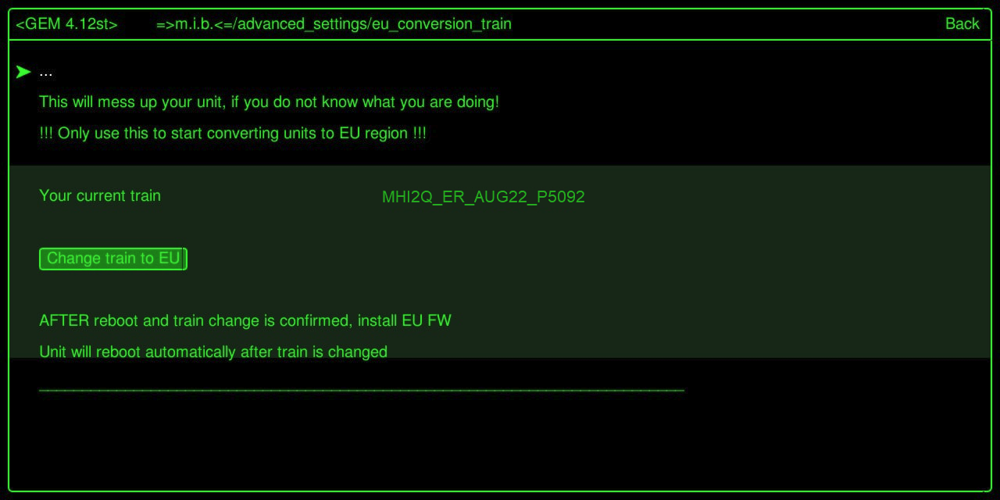
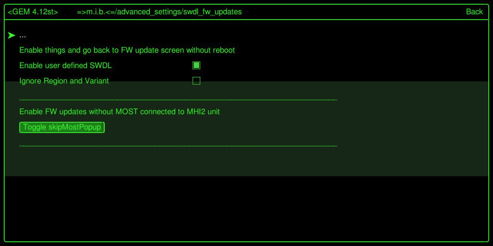
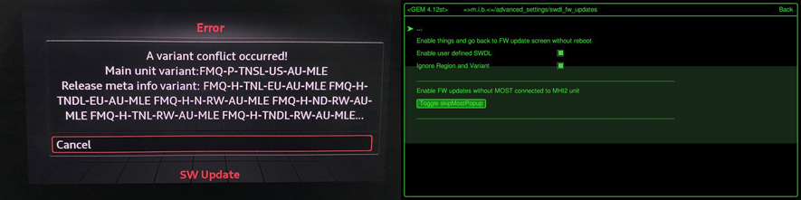
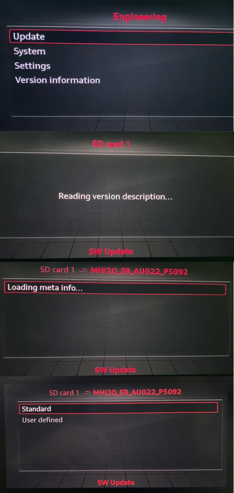
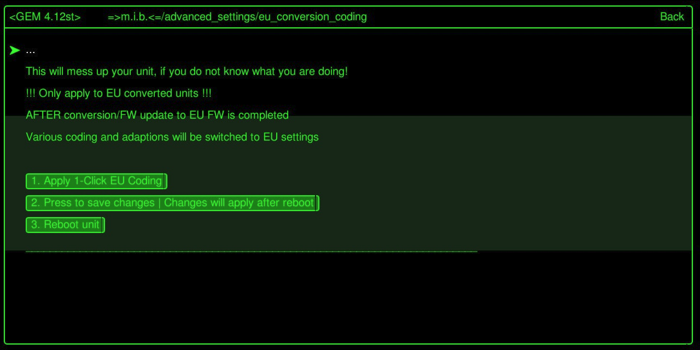

# MHI2 EU conversion

# MHI2 EU conversion

:::tip
In this **example** an unit with US FW train `MHI2Q_US_AUG22_P4246` will be converted to EU FW train `MHI2Q_ER_AUG22_P5092`
:::

:::info
Select target FW based on the train on your non US unit.

In case you are not sure which train is the fitting EU one, run "Change train to EU" function in M.I.B. and check the train that was chosen by the script. Download that FW and prepare SD card.
:::

## Preparation:

1. Get latest [M.I.B](/MHI2 MHI2Q Harman Aisin/M.I.B. - More Incredible Bash/) **beta** v3.1.0 and prepare 1st SD card → MIBSD

   Install M.I.B. as usual on your unit and make a backup!
2. Get [target EU FW](https://mibsolution.one/#/1/9/MHI2%20-%20HARMAN/Firmware/Audi) (`MHI2Q_ER_AUG22_P5092_MU1329 (A4-A5-Q5-Q7).7z`)  and prepare 2nd SD card → FWSD

## Step 1 - change train to EU

:::tip
MIBSD is entered into SD1 slot
:::

Enter GEM and use M.I.B to change train to EU version.

`Change train to EU` function will automatically select the right EU train, change eeprom and reboot unit.

 

After reboot the menu will show the new EU train

 

## Step 2 - install EU FW

:::tip
MIBSD is entered into SD1 slot
:::

### Enter GEM and select "Enable user defined SWDL"

 

### Optional

 

Exit GEM - NO reboot

:::tip
remove MIBSD

insert FWSD into SD1 slot
:::

### Enter red menu

 

## Step 3 - apply EU coding to Unit

:::tip
MIBSD is entered into SD1 slot
:::

Enter GEM and select:

1. "Apply 1-Click EU coding"

   All relevant cosing (long cosing and adaptions) will be changed to EU settings.
2. "Press to save changes"
3. "Reboot Unit"

 Step 4

When eu conversion coding step 1 - 2 - 3 done, you should to go to MMI Settings / Factory Settings / Select All / Factory Reset

All good, enjoy like always!