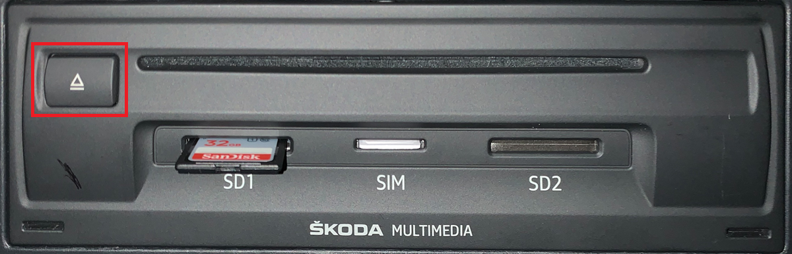

# Manually prevent shutdown by watchdog timer

:::info
When you run [Emergency IFS](/MHI2 MHI2Q Harman Aisin/Recovery/RCC/How to mount RCC NOR (fs0)/How to boot ifs-emergency.ifs (start blue emergency EFU)/) without [ignition emulator](https://mibwiki.one/doc/simulate-ignition-KOw2FI2dTD), and you did not enable [DeveloperMode](/MHI2 MHI2Q Harman Aisin/Recovery/RCC/How to mount RCC NOR (fs0)/How to boot ifs-emergency.ifs (start blue emergency EFU)/), the watchdog timer automatically shuts the MIB down in 60 seconds.
:::

To prevent the shutdown, press DVD eject button every 30-50 seconds:

 