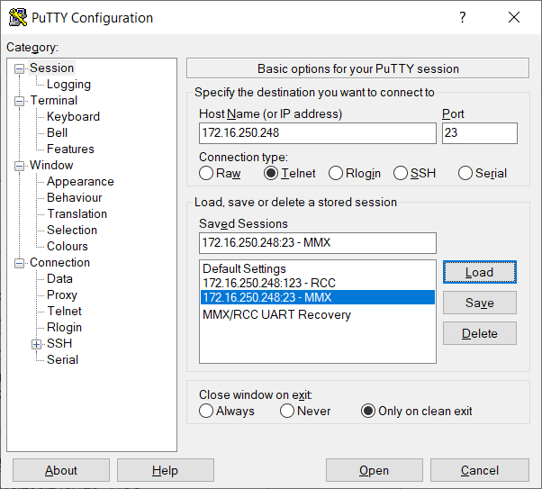
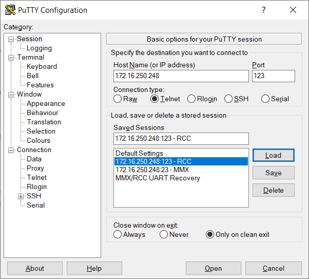

# Telnet client- Putty

## Telnet client

Any Telnet client can be used. The most popular is <https://www.putty.org/>

The MHIG/MHI2/MHI2Q support two telnet ports to login to [RCC and MMX](/MHI2 MHI2Q Harman Aisin/M.I.B. - More Incredible Bash/POG24 & BYG24 - AndroidAuto & CarPlay Widescreen Patch/Hardware MHI2/)

·         IP address for both: 172.16.250.248

·         RCC port: 123

·         MMX port: 23

:::info
Recommendation: Always use RCC, in case of wrongly used flash commands the risk to damage MMX is smaller.

:::

## Putty settings

:::info
[D-LINK](/General information/Bench Setup & Tools/D-Link DUB-100 Ver. D1 - 0x2001, 0x1a02/) or compatible USB to ethernet adapter required

On the PC set IP address to: 172.16.250.123 Net mask: 255.255.255.0

:::

 

 

\