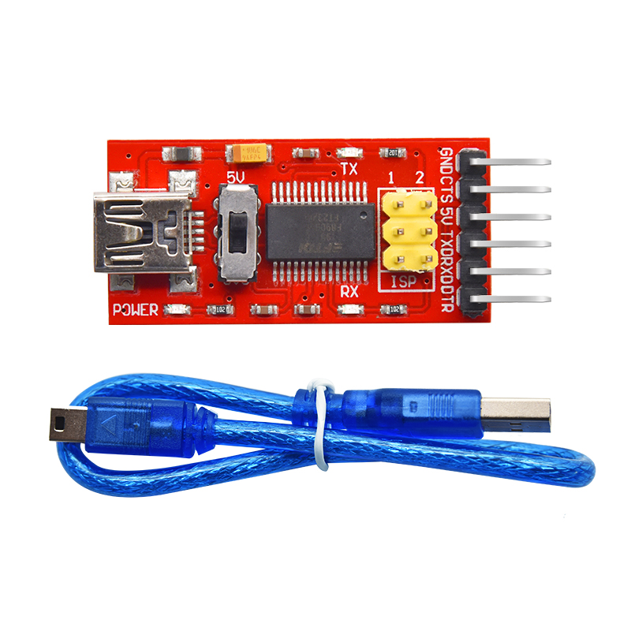
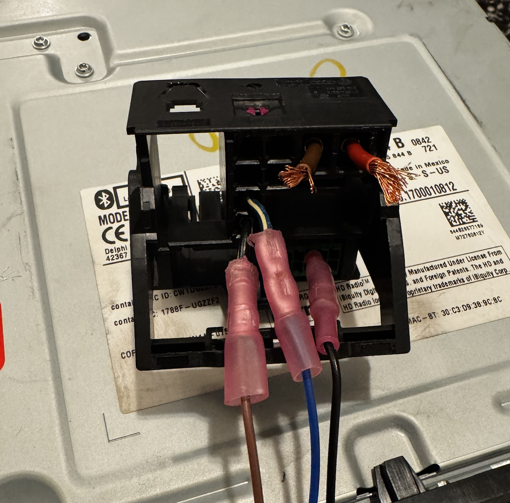
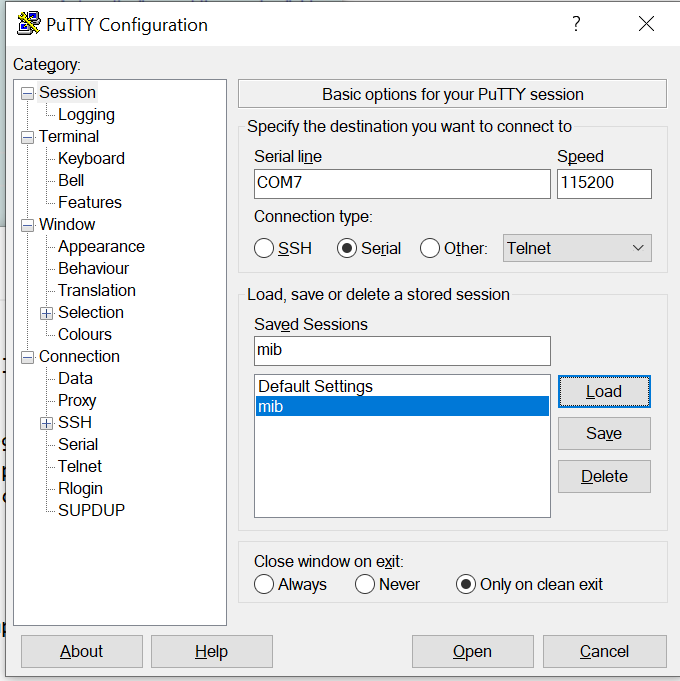
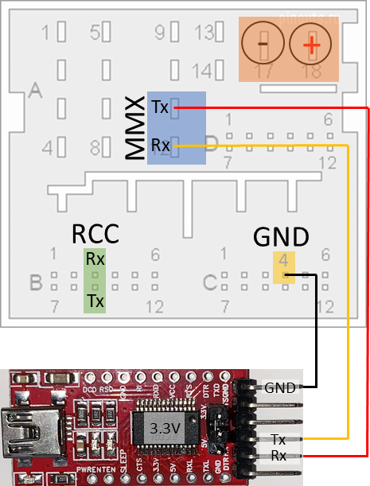
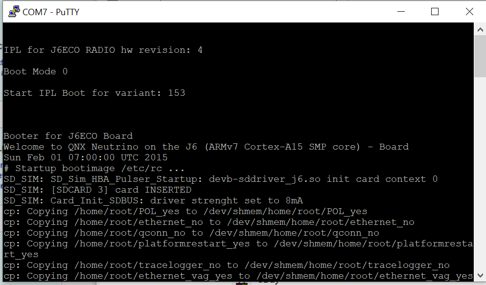

# MIB2 Wrong CP Patch Recovery

# MIB2 Wrong Patch Recovery

I've found it's much easier to do things right the first time, but if you messed up there are some things you can try. If you are unsure of what patch to use, DON'T patch your unit as it will brick it. Reach out on Telegram or Discord and ask for help, or pay for a patch to be created if needed.

## First Steps:

Doing this work in a car will be difficult if not impossible, so a bench power supply setup is basically required. The first thing you can try is to aquire the proper .ifs file, move it to an SD card with the delphi.sh autorun, and pray that the unit still is able to boot far enough to run the script. If it is, you'll see the familiar "completed successfully" screen and the unit should work like normal again. Try rebooting a few times as sometimes I have noticed the file gets close to copying but does not complete before the unit crashes. If your unit is still bricked, it's time to get it set up on the bench

## Bench Setup:

 

To set the radio up on the bench to communicate to it you will need:

* Windows laptop with PuTTY installed
* 12v power supply
* USB FTDI232 board


 These three things are the bare minimum, however, I reccomend a quadlock to plug into the radio. I personally used a quadlock that was included with one of my used units from eBay, and repinned it where I needed connections. However, I was able to get away with things inmy toolbox to get it running so this is just helpful.

 


This is the config youll need to have for PuTTY. Keep in mind your COM port may not be COM7, and you wont have the saved "mib" that is highlighted blue. However, once you set the settings above you can save them as whatever you'd like.

 

The FTDI wiring is shown here. The GND pin is easy to connect to since it is the same size as the pins on the USB board, however the Tx and Rx pins are larger and you may need to get creative if you don't have a quadlock handy. I ended up using wire crimps and bent them into an oval shape, which worked but they barely held on and led me to eventually make the quadlock.


\
Once you're all set up, press "open" on PuTTY and your command line should open. Click the phyiscial eject button on your MIB2 and it should fire up, and youll start to see text on the PuTTY terminal. If not, the wiring is likely not correct.

 

Let your radio boot loop for a couple times and get familiar with its behavior. Take note of when (or if) the text ever stops. This is a good point to run commands as youll be able to easily see what the reply is. However, commands can be executed at any point if you need extra time for a file to copy.

Here are some basic QNX commands:

```bash
ls /dev/ #lists all devices. Look for sdc1, sdc0, or a variation like sdc0t11 (t11 means fat32)
mount #lists all mounted volumes and their locations
umount [device] #unmounts device
fdisk [device] #partition manager (does not work on the MIB2, but is needed in VM)
```

The first step to recovery is getting the MIB2 to read the correct IFS that we want to copy. If your SD card is shown when you execute the "mount" command, then you are ready to attempt to copy the file.

```bash
cd / && mount -uw /sdc1/; sleep 1
cp -Vfr /sdc1/delphibin.ifs /extbin/apps/bin/delphibin.ifs; sleep 1
MountPathSync /extbin/apps; sleep 1
```

These lines are from the basic delphi.sh script that are supposed to autorun, however we can run the script sooner using our terminal connection. Copy all of the text, and press shift and insert on your keyboard to copy the lines into PuTTY, and press enter for good measure. If all goes well, you should start to see that the file is being copied, along with a percentage going up. After the file is transfered, you may need to press enter again to run the "MountSyncPath" command.

If you have successfully copied the file, you should notice that after rebooting the terminal window has lots more text flowing through, and that your unit stays on longer. Both of my units still shut down until I connected it back up to the display in my car.

## Still getting errors?

Don't fear! you may still be able to recover your MIB. First, study the terminal window and read the errors presented when you attempt to run the script above. If you see sdc0, or sdc0t11 in /dev/ you can try replacing sdc1 with sdc0 or sdc0t11. If the above script does not run properly, it likely means that your SD card is not mounting properly or at all.

```bash
mount /dev/sdc0;
cd sdc0
```

Run the above commands seperatly. If you are able to execute the mount command with no errors (there is no output if the mount is successful) but you get an error when executing "cd sdc0" such as "corrupt file system" then your unit likely no longer has the ability to mount fat32 drives in its current state. For me, whenever I attempted to mount my SD card it would try to mount it as the qnx4 file system.

## Formatting an SD card with the qnx4 filesystem.

Oh boy! this was a fun one. Download Virturalbox and the QNX 6.5 ISO. Create the VM and start it up with the QNX 6.5 ISO. Make sure to enable passthrough for both a USB flash drive with your correct .ifs file, and the SD card you want to format. I also set the USB controller to USB 1. (image coming soon)

Once the VM has started, press F2 to run as a live CD, set your graphics settings, and log in (username "root", password "root").

Open the terminal and run "mount." you should see your SD card and USB drive already mounted. If not, you may have an issue with the virturalbox passthrough.

```bash
fdisk dev/hd10/
```

Lets format the SD card first. It should be called hd10 or hd20. You can check the contents of the drives