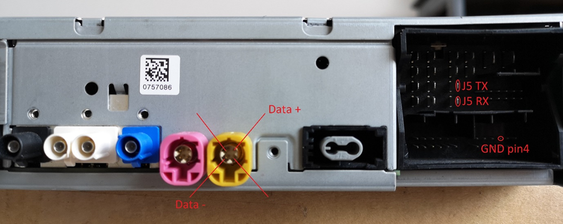
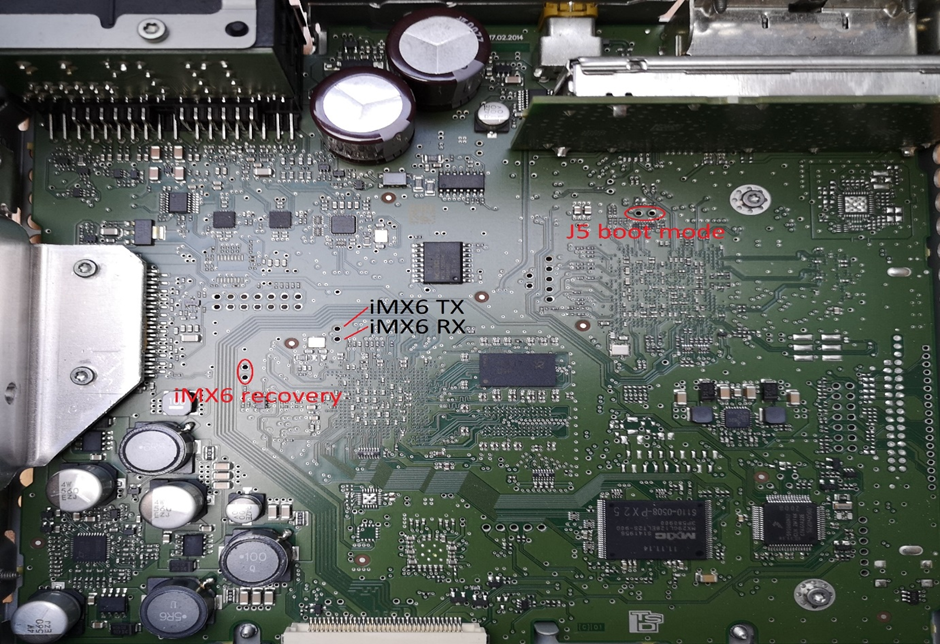
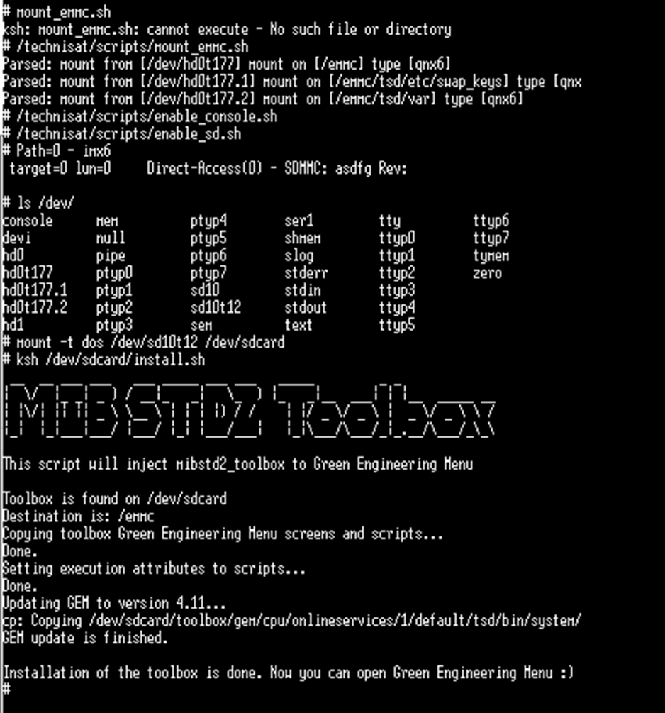

# USB2HSD Method in a nutshell

:::info
You need the toolbox files on a FAT32 SD Card (prepared for 01/02 or 03/04 Firmware).
:::

Source <https://www.drive2.ru/b/646562041351386364/> (among others)


1. Do not insert power until the manual tells you!
2. Put SD card with toolbox into the unit.
3. Copy the folder "patcher" to "C:\\"
4. Prepare both UART Devices. Open two putty windows. The BAUD Rate is 115200 each. The J5 Quadlock pins are the same on ZR and PQ. Connect GND, J5 TX/RX and iMX6 TX/RX to UART device. One Ground connection should be enough!

 


5. Short the points "iMX6 recovery" and "J5 Boot mode". **Leave them shorted all the time.** 
6. Open cmd as admin and enter cd C:\\patcher

   
   1. Type in plus1.bat but **not hit enter yet**.
7. Power on the unit.


:::info
In case the usb it keeps resetting (you hear usb plugging/unplugging sound on pc withing seconds) try first 5, 2, 1. The unit will boot (you'll see in the J5 putty), but just cut off power and put it back on and try 5 and 7.  After 7, you will hear USB plugged-in sound.
:::

 8. Go to the cmd, where plus1.bat is and hit enter. You will hear USB disconnect sound afterwards.
 9. Just after that, type plus2.bat and hit enter.
10. In the iMX6 windows, when you see a **#**, hit enter several times. It will give you access to the shell. Type the following prompts:


:::info
Copy the lines one after the other and only put them in line by line. Be quick:
:::

```javascript
ls /technisat/scripts/
/technisat/scripts/mount_emmc.sh
/technisat/scripts/enable_console.sh
/technisat/scripts/enable_sd.sh
ls /dev/
mount -t dos /dev/sd10t12 /dev/sdcard
ksh /dev/sdcard/install.sh
```

After that done, you can unplug power and remove connectors and tweezers from the board. Toolbox is installed now.

The following screenshots shows a successful installtion of the toolbox.

 


:::tip
If you want to keep the Toolbox installed when updating, do a manual SWDL and unselect CPUplus→ESD.
:::

