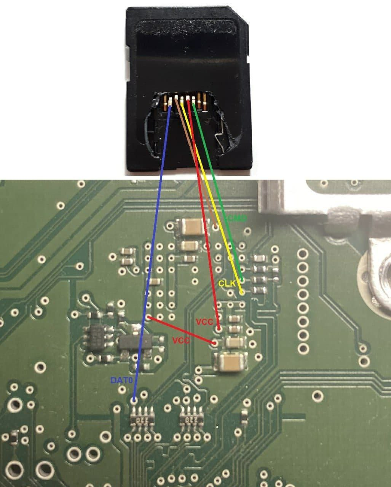
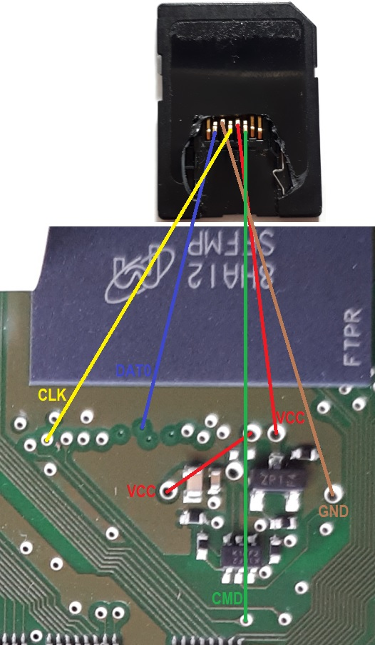
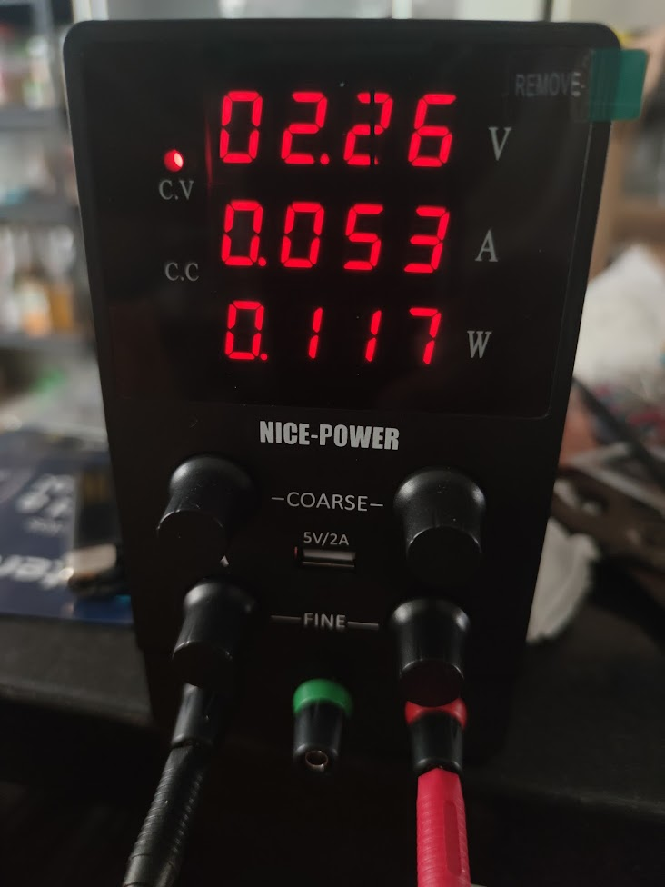
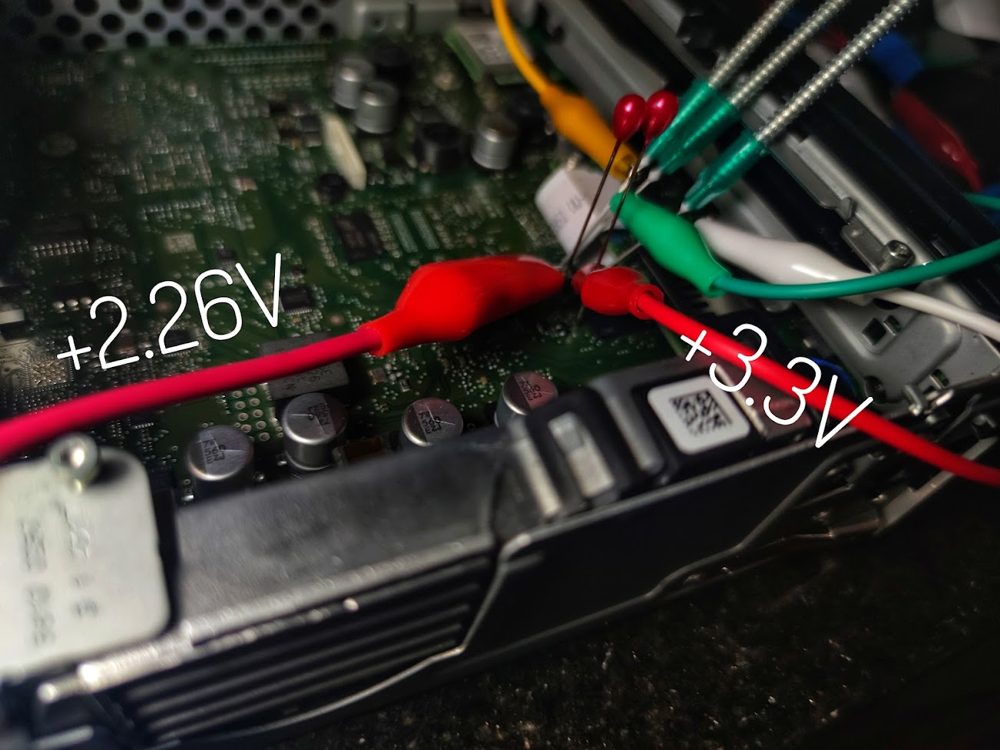
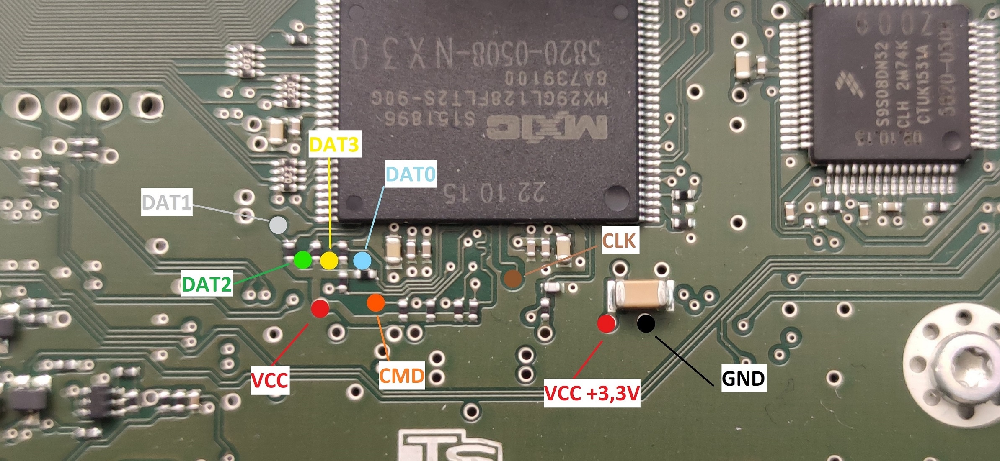

# Reading/writing eMMC

:::warning
There is a high **chance to brick your device**. For everything you do **ONLY you are resposible!**

:::

## Some basic information

:::tip
Read the whole tutorial and nested documents to understand what you have to do.

1. Read memory content and save it to `IMG` file.
2. Convert `IMG` to `VMDK`\*
3. Mount `VDMK` in QNX VM\*
4. Do your stuff in QNX VM\*
5. Convert (modified) `VMDK` to `IMG`\*
6. Write your modified `IMG` back to the Unit

\* Step 2-5 if you want to modify data.

:::

:::info
If you want to modify data, the easiest and (in my opinion) the safest way will be to install the MIB Toolbox.

:::

This repository contains some scripts, documentation how to upgrade the MIB2 firmware to a different SW/HW train (e.g.: `02xx` → `03xx`/`04xx`) and other things. The documentation is for the Technisat MIB STD2 unit without navigation and works also on units with navigation. It describes how to patch the `swdownload` binary, that the unit accepts updates for a higher HW train. Install the MIB2 Toolox, and other things (maybe soon).

Some of this informations are from another tutorial using Linux. I add the informations to use Windows and Qemu (nested Docs) and leave the additional Infos with Linux and modify the swdownload section for upgrade the SW as written before untouched as nested document. \n In addition to this (and  nested) repository it's required to have access to the`MIB Solutions`. There you find the firmware updates and tools to patch the `swdownload` binary.

The tutorial will be continued.

:::info
For MIB2 without navigation it's currently not possible to patch the `swdownload` binary with the `Update-Approval_SOP4_signed` method, because of the different CPU (`cpuplus` instead of `cpu`). To patch the `swdownload`you have to dump the eMMC, exchange the binary and write everything back to the unit. \n The eMMC of the MIB2 with navigation can be read with an adapter from the second SD card reader. For the model without navigation the only way to read the eMMC is to connect to the through-hole plating on the PCB. This can be done by soldering very thin wires to the holes or contact them with probes or use BDM needles.

:::

:::tip
Save your "untouched" dump if you want to do a complete restore!

:::

## Read/Write prepare the HW

Connect a SD card reader ([SD Card Readers (working/not working)](/doc/sd-card-readers-workingnot-working-bEzQx5OFBk)) to the eMMC through-hole plating (soldering or probes). For me the connection was only stable with `DATA0` connected and `DATA1-3` disconnected (slow read & write). You can bridge the `VDD` (`3,3V`) as seen on the second picture. The `VDD` is translated into two voltages values, one for the Core and the other for the I/O. Take into account that not all the eMMC chips use the same values for the Core Voltage (`VCC`) and the I/O Voltage (`VCCQ`), usually the `VCCQ` voltage is slightly lower. Also not all  SD card readers give the full 3.3V. In the following pictures the `VCC` is at the top right and the `VCCQ` is at the bottom left. Usually `VCC` works with +2.7\~+3.6V and `VCCQ` works with +1.1\~3.6V, depending on the chip. There are some cases where `VCCQ` needs to be at least +2.1V and less than +2.4V; if the voltage exceeds that range the I/O part of the chip gets over-voltage protection and the dump is corrupted.

:::warning
If you put too much voltage to the I/O `VCCQ` portion of the chip, the read will have a lot of failures, making it unusable (usually a lot of CRC errors). If you find yourself having this after bridging the voltage points try to decrease the voltage for the `VCCQ` portion (the one at the bottom left according to the next picture)

:::

## [Working SD Card Readers](https://mibwiki.one/share/bf19d753-44b8-4726-91b1-2d56fbb5f9d2)

### ZR

eMMC pinout (with all `DAT`lines): \n [                                                 ](https://github.com/Feserich/mib2std-zr-firmware-upgrade/blob/master/images/probe_points.jpg) 

* Another pinout for ZR this box have emmc component on the bottom side of the card (Skoda 5Q0035819\*):

   
* See [this image](https://www.electroniccircuitsdesign.com/sites/default/files/img/sd-card-pinout.png) for a SD card pinout (and `DAT0` only) (the `VCC` to `VCC` is a bridge from the upper left to the bottom left. If you dont want to use a bridge, you have to put the second `VCC` to the bottom left).

   
* Voltage for `VCCQ` at +2.26V avoiding the I/O part of the chip to fail do to over-voltage

   
* example of two different voltages for `VDD`(`VCC` AND `VCCQ`) with alternative pinout (yellow is `CMD`, green is `CLK` and white is `DAT0`)          
* example ZR of probes soldered to a USB SD card reader (alternative pinout) [                                                 ](https://github.com/Feserich/mib2std-zr-firmware-upgrade/blob/master/images/emmc_with_probes.jpg) 

### PQ

 

:::tip
PQ Unit is slower with `DAT0` only compared to ZR Units. (around 2,5MB/s)

This is also dependent on the SD card reader used, ZR units could be also have a slow (2.7MB/s) connection do to the usage of an old adapter

:::

## Windows 8/10

### Read

Connect the wires/SD Card/Card Reader and open the **[HDD Raw Copy Tool](https://hddguru.com/software/HDD-Raw-Copy-Tool/)**

Select Source → Select your Card Reader (take a look at the nested Docs for working Card Readers)

Select Target → FILE save and name it where/as you want (`Dump.img` for example)

START. It will take some time because reading/writing with only one `DAT0` line happens with around `5MB/s`. (ZR Units)

### Write

Connect the wires/SD Card/Card Reader and open the **[HDD Raw Copy Tool](https://hddguru.com/software/HDD-Raw-Copy-Tool/)**

Select Source → FILE (`Dump.img` - After you modified your data or want to write a backup)

Seldect Target → CardReader

START. It will take some time because reading/writing with only one `DAT0` line happens with around `5MB/s`. (ZR Units)

## Linux

<https://mibwiki.one/share/954d321f-7e61-481b-8bd2-24b53a19cc45>

:::tip
If Something wents wrong there is maybe a contact Problem. The solution works definately when the contact is fine. I use a glass fiber pen to clean the contacts and seal it after the work is done. It's on you, if you want to to it or not.

Also had a problem with a defect SD Card Reader (Read only, No write).

:::

:::tip
If using only  `DAT0` :

Not all readers support operation using only `DAT0` line. If you encounter strange problems during detection, try taping over the `DAT1` to  `DAT3` on a normal sd card to check your reader supports this operation.

:::

## Useful References

* <https://www.digital-eliteboard.com/threads/mib2-std-pq-zr-how-to-update.494459/>
* <https://forum.xda-developers.com/t/success-to-hack-technisat-mib2-infotainment-system.3584185/>
* https://www.drive2.ru/l/573969809784439237/ (use google translator)
* https://www.drive2.ru/l/568827668779238365/ (use google translator)

## Useful Adapter if you dont want to use a micro SD/SD Adapter and some other parts…

**[SD Adapter](https://de.aliexpress.com/item/1005001970455276.html)**

**BDM probes**

**[Glass fiber pen](https://www.amazon.de/Faber-Castell-180300-Glasradierer-Schaftfarbe-Ersatzminen/dp/B016ZXN3NG/ref=sr_1_5?__mk_de_DE=%C3%85M%C3%85%C5%BD%C3%95%C3%91&crid=18ZNHZ2AVYYHG&keywords=glasfaserstift&qid=1642755223&sprefix=glasfaserstif%2Caps%2C124&sr=8-5)** (if you want to clean the PCB from the green shell)

**[Solder resist ink (green)](https://www.amazon.de/gp/product/B07SS2BCCP/ref=ppx_yo_dt_b_asin_title_o04_s00?ie=UTF8&psc=1)** for fixing the cleaned parts